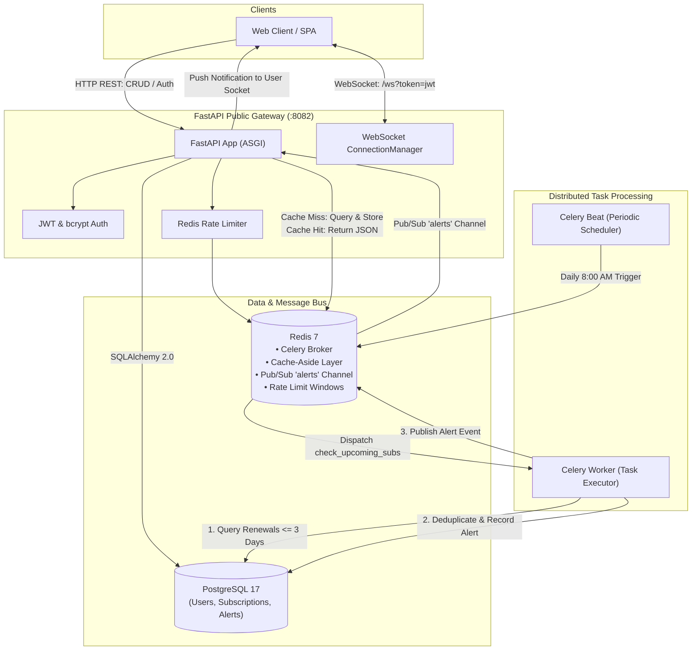

# StarDust — Event-Driven Subscription & Billing Alerts

[](https://github.com/editsbyrafayyy/Stardust-Event-Driven-Billing-Alert-Engine/actions)


**StarDust** is a production-grade, event-driven subscription management and real-time billing alert engine. Built with **FastAPI**, **PostgreSQL**, **Redis**, and **Celery**, it tracks recurring billing cycles across mixed frequencies (yearly, quarterly, weekly, daily), aggregates analytics via Redis Cache-Aside, schedules periodic scans with Celery Beat, and delivers real-time renewal alerts directly to browser clients over full-duplex WebSockets using Redis Pub/Sub.

---

## System Architecture



---

## Core Engineering Features

### 1. Multi-Tenant Security & Authentication
* **Password Hashing**: Passwords are never stored in plaintext — hashed using `passlib` + `bcrypt` with salt and 12 cost-factor rounds.
* **Stateless JWT Authorization**: Issues signed `HS256` tokens with configurable expiration (`exp` claim).
* **Row-Level Tenant Isolation**: Endpoints enforce strict ownership filtering (`owner_id == curr_user.id`). Unauthorized attempts return `404 Not Found` (rather than `403 Forbidden`) to prevent resource enumeration attacks.

### 2. Event-Driven Background Jobs & Alert Deduplication
* **Celery + Redis**: Long-running or scheduled tasks run out-of-band in separate container processes without blocking the FastAPI async event loop.
* **Celery Beat**: Periodic cron scheduler triggers daily scans (`tasks.check_upcoming_subs`) at 8:00 AM.
* **Deduplication Engine**: Alerts are checked against `(sub_id, renewal_date)` composite uniqueness before insertion, preventing duplicate spam across successive runs.

### 3. Real-Time WebSockets & Redis Pub/Sub
* **Full-Duplex Communication**: Clients connect to `/ws?token=<jwt>` for instant server-push notifications.
* **Multi-Device Support**: `ConnectionManager` maps a single `user_id` to multiple concurrent WebSocket connections (e.g. mobile and desktop).
* **Zero Connection-Pool Exhaustion**: Handshake authenticates with a short-lived DB session, ensuring long-lived WebSocket connections never exhaust PostgreSQL connection pools.
* **Cross-Process Bridge**: When Celery workers process alerts, they publish to Redis `alerts` channel; FastAPI’s background `redis_listener` catches events and pushes them down live WebSockets.

### 4. Cache-Aside Caching & Billing Normalization
* **Cache-Aside Pattern**: `GET /subscriptions/summary` caches monthly spend and 7-day upcoming renewals in Redis with a 5-minute TTL safety net.
* **Active Invalidation**: Mutating operations (`POST`, `PATCH`, `DELETE`) immediately evict `summary:{user_id}`, preventing stale reads.
* **Multi-Cycle Normalization**: Accurately normalizes multi-frequency cycles into monthly figures:
  $$\text{Yearly} \div 12 \quad\Big|\quad \text{Quarterly} \div 3 \quad\Big|\quad \text{Weekly} \times \frac{52}{12} \quad\Big|\quad \text{Daily} \times 30$$
* **Graceful Degradation**: If Redis is unavailable, requests seamlessly fall back to PostgreSQL queries.

### 5. API Rate Limiting (Brute-Force & DoS Defense)
* **Atomic Redis Pipelines**: Implements atomic `INCR` and `EXPIRE` fixed-window rate limiting.
* **Protection Zones**:
  * `/login`: 5 attempts / minute per IP address.
  * `/subscriptions/summary`: 30 requests / minute per user ID.
* **Standard Compliance**: Returns `429 Too Many Requests` with a `Retry-After: 60` header.
* **Fail-Open Resilience**: Catches `RedisError` and fails open to maintain API availability during cache hiccups.

---

## Comprehensive Automated Testing Suite

The repository includes **18 automated unit and integration tests** and an **End-to-End (E2E) Docker test suite**:

| Test Suite | Domain | Description |
|---|---|---|
| [`test_auth.py`](file:///home/rafay/Projects/StarDust/tests/test_auth.py) | **Authentication** | User registration, password hashing verification, JWT generation, invalid credentials, and duplicate username rejection. |
| [`test_subscriptions.py`](file:///home/rafay/Projects/StarDust/tests/test_subscriptions.py) | **CRUD & Multi-Tenancy** | Subscription creation, unauthorized access blocking, partial updates (`PATCH`), deletion, and multi-tenant boundary checks. |
| [`test_summary.py`](file:///home/rafay/Projects/StarDust/tests/test_summary.py) | **Analytics & Caching** | Normalization math across frequencies, 7-day upcoming renewal filtering, and complete Cache Hit/Miss/Eviction lifecycle. |
| [`test_rate_limiter.py`](file:///home/rafay/Projects/StarDust/tests/test_rate_limiter.py) | **Rate Limiting** | Threshold blocking (`429`), `Retry-After` headers, and fail-open resilience. |
| [`test_tasks.py`](file:///home/rafay/Projects/StarDust/tests/test_tasks.py) | **Background Celery** | Renewal scan detection, Alert creation, Redis publication, and duplicate suppression. |
| [`test_ws.py`](file:///home/rafay/Projects/StarDust/tests/test_ws.py) | **WebSockets** | Valid handshake authentication and invalid token rejection (`1008 Policy Violation`). |
| [`test_live_docker.py`](file:///home/rafay/Projects/StarDust/tests/e2e/test_live_docker.py) | **Live Docker E2E** | Full multi-container user journey running against live Docker containers on `localhost:8082`. |

### Running the Test Suite:
```bash
# Run unit & integration tests (runs in ~5s with in-memory SQLite & mocked Redis)
pytest -v

# Run full suite including live Docker E2E (requires docker compose up -d)
pytest
```

---

## API Reference

### Authentication
* `POST /register` — Register a new account (`{"username": "...", "password": "..."}`)
* `POST /login` — Authenticate and receive JWT Bearer token (Form URL-Encoded)

### Subscriptions
* `POST /subscriptions` — Create a new subscription
* `GET /subscriptions/{id}` — Retrieve a subscription by ID
* `PATCH /subscriptions/{id}` — Update subscription fields (cost, renewal date, etc.)
* `DELETE /subscriptions/{id}` — Delete a subscription

### Analytics & Real-Time
* `GET /subscriptions/summary` — Get total monthly spend & upcoming 7-day renewals (Cached in Redis)
* `GET /ws?token=<jwt>` — WebSocket endpoint for live server push notifications

---

## Running Locally with Docker Compose

### Prerequisites
* [Docker](https://docs.docker.com/get-docker/) & Docker Compose
* Python 3.12+ (for local development)

### 1. Clone & Configure Environment
```bash
git clone https://github.com/editsbyrafayyy/Stardust-Event-Driven-Billing-Alert-Engine.git
cd Stardust-Event-Driven-Billing-Alert-Engine

# Copy sample environment variables
cp .env.example .env
```

### 2. Start the Multi-Container Stack
```bash
docker compose up --build
```

The stack will start 5 coordinated containers:
* **`postgres-db`**: PostgreSQL 17 database (`localhost:5432`)
* **`redis-broker`**: Redis 7 message broker & cache (`localhost:6379`)
* **`sub-app`**: FastAPI REST API & WebSocket server (`http://localhost:8082`)
* **`worker`**: Celery background task worker
* **`beat`**: Celery Beat task scheduler

### 3. Access Interactive API Documentation
Open your browser and navigate to:
* **Swagger UI**: [http://localhost:8082/docs](http://localhost:8082/docs)
* **ReDoc**: [http://localhost:8082/redoc](http://localhost:8082/redoc)

---

## Cloud Deployment (Render / Railway Blueprint)

The repository includes an Infrastructure-as-Code blueprint ([`render.yaml`](file:///home/rafay/Projects/StarDust/render.yaml)) configured for one-click deployment:

1. Connect your repository to [Render](https://render.com).
2. Click **New $\rightarrow$ Blueprint**.
3. Render automatically provisions:
   * 1x Managed PostgreSQL Database
   * 1x Managed Redis Instance
   * 1x Public FastAPI Web Service (with auto-assigned SSL & dynamic `$PORT`)
   * 1x Private Celery Background Worker
   * 1x Private Celery Beat Scheduler

---

## License
MIT License. Built for educational and portfolio demonstration of modern asynchronous backend system design.
